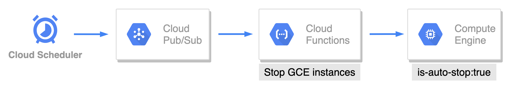

# auto-stop-gce-instances

## Architecture


## How to deploy

### 1. Deploy Pub/Sub
```
$ gcloud pubsub topics create $PUBSUB_NAME
```

### 2. Deploy Cloud Functions
```
$ gcloud functions deploy $FUNCTIONS_NAME \
    --runtime go113 \
    --trigger-topic $PUBSUB_NAME \
    --region asia-northeast1 \
    --set-env-vars GCP_PROJECT=$GCP_PROJECT
```

### 3. Deploy Cloud Scheduler
```
$ gcloud scheduler jobs create pubsub $SCHEDULER_NAME \
    --time-zone "Asia/Tokyo" \
    --schedule "0 21 * * 1-5" \
    --topic $PUBSUB_NAME \
    --message-body '{"labelKey":"is-auto-stop", "labelValue":"true"}' \
    --description "Automatically stop gce instances"
```

## References
- [Go での依存関係の指定](https://cloud.google.com/functions/docs/writing/specifying-dependencies-go?hl=ja)
- [Go ランタイム](https://cloud.google.com/functions/docs/concepts/go-runtime#contextcontext)
- [環境変数の使用](https://cloud.google.com/functions/docs/env-var)
- [google.golang.org/api/compute/v1](https://pkg.go.dev/google.golang.org/api@v0.60.0/compute/v1)